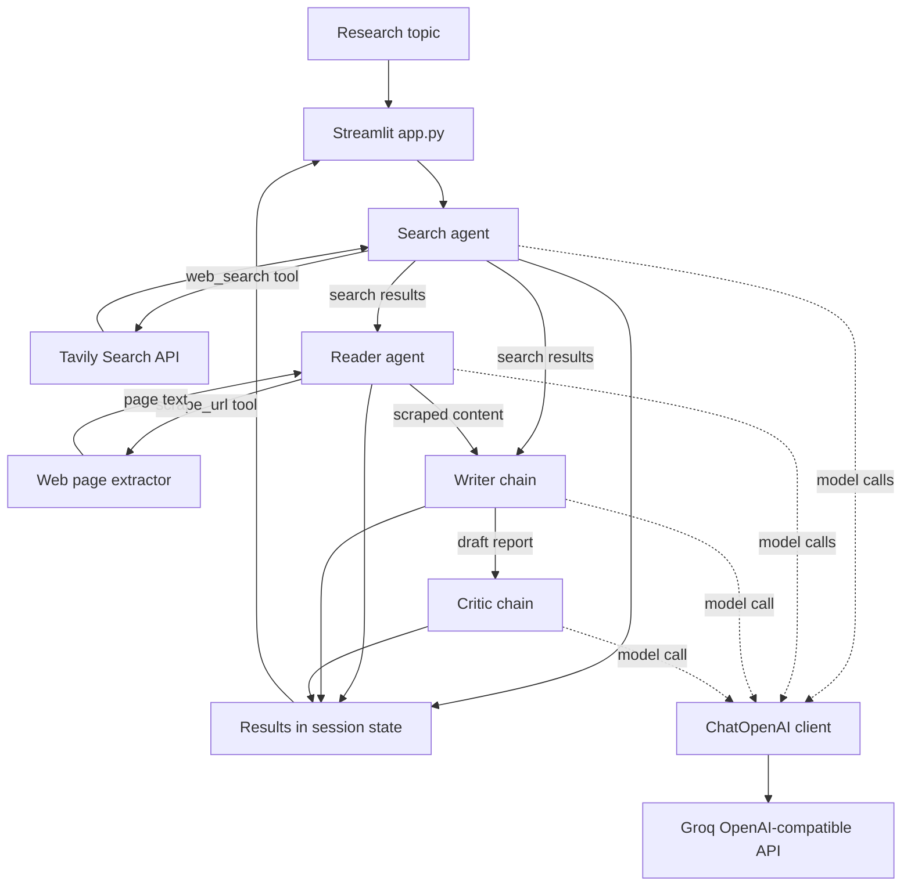

# Multi-Agent Research System

A Streamlit research assistant that uses LangChain agents and chains to search
the web, read a relevant source, draft a report, and critique the result.

## Features

- Searches for recent information with Tavily and returns up to five results.
- Selects a relevant URL and extracts article text using Trafilatura, with Readability and BeautifulSoup fallbacks.
- Drafts a structured report with an introduction, at least three key findings, a conclusion, and sources.
- Reviews the report with a score, strengths, areas to improve, and a verdict.
- Shows raw search and scraped content and lets you download the report as Markdown.
- Displays progress through the search, reader, writer, and critic stages.

## Architecture

The Streamlit app coordinates the stages and stores their outputs in Streamlit
session state. The search and reader are tool-using LangChain agents; the writer
and critic are prompt-and-model chains. All four use the shared chat model
configured in `agents/agents.py`.



The Streamlit app orchestrates these stages directly. A separate synchronous
orchestrator is available as `run_research_pipeline(topic)` in
`pipelines/pipeline.py`; it shares the same agents and chains but is not called
by the Streamlit app.

### Project layout

```text
src/multi_agent_research_system/
|-- app.py                 # Streamlit interface and UI orchestration
|-- agents/agents.py       # Shared model, search/reader agents, writer/critic chains
|-- tools/tools.py         # Tavily search and web-page extraction tools
|-- pipelines/pipeline.py  # Separate synchronous pipeline function
`-- main.py                # Runs the pipeline with a sample topic
```

### Component details

- **Chat model:** `ChatOpenAI` uses Groq's OpenAI-compatible endpoint and the `openai/gpt-oss-20b` model, with temperature `0.2` and a 2,000-token response limit. The code reads `GROQ_API_KEY` first, with `OPENAI_API_KEY` as a fallback variable name.
- **Search tool:** Tavily returns up to five results. Each result includes its title, URL, and a snippet shortened to 300 characters.
- **Reader agent:** It receives the first 800 characters of the search output and chooses a URL to scrape. Requests time out after 15 seconds.
- **Page extraction:** Trafilatura is tried first, followed by Readability and then a BeautifulSoup text fallback. Extracted text is limited to 5,000 characters.
- **Writer and critic:** The writer asks for an introduction, at least three explained findings, a conclusion, and sources. The critic returns a score, strengths, improvement areas, and a one-line verdict.
- **UI state:** Each completed stage is saved to `st.session_state.results`; the app displays raw search and page content, the report, and the critique. The report download is Markdown.

## Requirements

- Python 3.11 or newer
- [uv](https://docs.astral.sh/uv/)
- A Tavily API key
- A Groq API key

## Setup

From the project root, install the dependencies:

```powershell
uv sync
```

Create a `.env` file in the project root and add your API keys:

```dotenv
TAVILY_API_KEY=your_tavily_api_key
GROQ_API_KEY=your_groq_api_key
```

The chat model is configured through Groq's OpenAI-compatible API using the
`openai/gpt-oss-20b` model identifier. Keep `.env` private and do not commit
your API keys.

## Run the app

```powershell
uv run streamlit run src/multi_agent_research_system/app.py
```

Open the local URL printed by Streamlit, enter a research topic, and select
**Run Research Pipeline**. The completed report appears below the pipeline and
can be downloaded as a `.md` file.

## Research flow

1. **Search:** LangChain invokes the Tavily search tool for recent sources.
2. **Reader:** A second agent chooses a relevant URL and invokes the page extraction tool. Extracted page content is limited to 5,000 characters.
3. **Writer:** The chat model combines the search results and extracted content into a structured report.
4. **Critic:** The chat model evaluates the report and returns a score, strengths, improvements, and a one-line verdict.

Search, scraping, and model calls require working credentials and network access.
The available information and report quality depend on the sources returned by
the search service and the accessibility of those pages.
